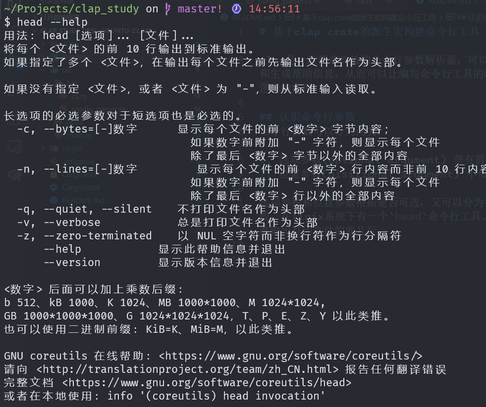
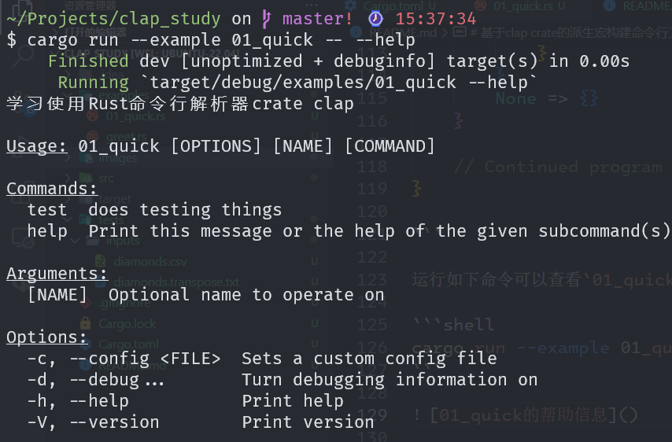
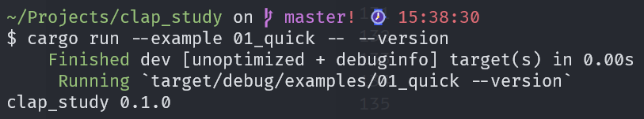
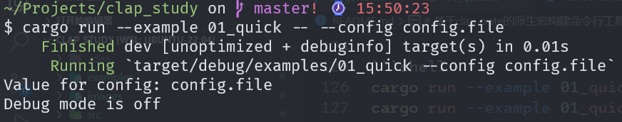
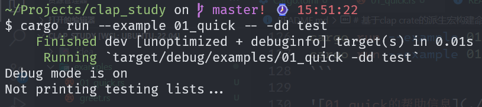

# 基于clap crate的派生宏构建命令行工具

clap是一款简单高效的命令行参数解析器，可以方便的解析命令行参数和生成帮助信息，从而可以让编写命令行工具的时候专注于各种功能和逻辑的实现。

## 1.认识命令行参数

命令行参数可以分为两类：

1. 选项参数(optional argument) 带有前置标记的参数
2. 位置参数(pisitional argument) 不带有前置标记的参数

选项参数和位置参数根据是否可选，又可以分为可选的参数和必选的参数。选项参数可以带有值，也可以不带有值；位置参数在终端输入命令行的时候被相应的值替代。在linix系统下有一个`head`命令行工具。该命令行工具可以在标准输出打印文件的前几行。在终端输入以下命令可以打印`head`的帮助信息。
```shell
head --help
```



其中，usage(用法)显示了命令的基本使用方法：`head [选项]... [文件]...`。其中`选项`和`文件`分别是选项参数和位置参数，方括号括起来表示参数是可选的。可以在终端如下使用`head`命令。

```shell
# 什么参数都没有:从标准输入读取10行输入，并在标准输出输出
head
# n是选项参数的标记，后面的值2，是选项参数的值
# README.md是位置参数，直接在位置参数的位置用相应的值替换
head -n 2 README.md
```

## 2.创建crate并添加clap依赖

在`shell`中输入一下命令创建项目`clap_study`，进入项目目录中，添加clap依赖,并创建`examples`目录。在这个`examples`目录中，我会编写一些简单的例子以辅助对`clap`中概念的理解。

```shell
cargo new clap_study
cd clap_study
cargo add clap --feature derive
mkdir examples
```

## 3.快速入门

clap的官方文档中给除了一个快速入门的案例，尝试一下这个案例。

```shell
cd examples
touch 01_quick.rs
```
代码如下：

```rust
// examples/01_quick.rs
use std::path::PathBuf;

use clap::{Parser, Subcommand};

#[derive(Parser)]
#[command(author, version, about, long_about = None)]
struct Cli {
    /// Optional name to operate on
    name: Option<String>,

    /// Sets a custom config file
    #[arg(short, long, value_name = "FILE")]
    config: Option<PathBuf>,

    /// Turn debugging information on
    #[arg(short, long, action = clap::ArgAction::Count)]
    debug: u8,

    #[command(subcommand)]
    command: Option<Commands>,
}

#[derive(Subcommand)]
enum Commands {
    /// does testing things
    Test {
        /// lists test values
        #[arg(short, long)]
        list: bool,
    },
}

fn main() {
    let cli = Cli::parse();

    // You can check the value provided by positional arguments, or option arguments
    if let Some(name) = cli.name.as_deref() {
        println!("Value for name: {name}");
    }

    if let Some(config_path) = cli.config.as_deref() {
        println!("Value for config: {}", config_path.display());
    }

    // You can see how many times a particular flag or argument occurred
    // Note, only flags can have multiple occurrences
    match cli.debug {
        0 => println!("Debug mode is off"),
        1 => println!("Debug mode is kind of on"),
        2 => println!("Debug mode is on"),
        _ => println!("Don't be crazy"),
    }

    // You can check for the existence of subcommands, and if found use their
    // matches just as you would the top level cmd
    match &cli.command {
        Some(Commands::Test { list }) => {
            if *list {
                println!("Printing testing lists...");
            } else {
                println!("Not printing testing lists...");
            }
        }
        None => {}
    }

    // Continued program logic goes here...
}

```

运行如下命令可以查看`01_quick`的帮助信息，结果在图中展示。

```shell
cargo run --example 01_quick -- --help
cargo run --example 01_quick -- --h
```



查看`01_quick`的版本信息，运行命令和结果如下。

```shell
cargo run --example 01_quick -- --version
cargo run --example 01_quick -- -V
```



```shell
cargo run --example 01_quick -- --config config.file
cargo run --example 01_quick -- -c config.file
```



```shell
cargo run --example 01_quick -- -dd test
```



## 4.如何创建一个命令行工具

从快速入门程序中可以发现，创建一个命令行工具首先是分析需求，总结出需要实现的功能。其次是在功能分析的基础之上，做出抽象。将命令行抽象成自己的数据结构。在快速入门程序中，将命令行抽象出了两种数据结构：
- 将命令行抽象成了结构体`Cli`，将子命令抽象成了枚举类型`Commands`。
- 抽象的过程就是分析结构体`Cli`有什么样的字段，枚举类型`Commands`有什么样的变体。
- `Cli`的字段其实就是命令行的各种参数以及子命令。`01_quick`有位置参数name和选项参数mode、config,以及子命令command。所以`Cli`有四个字段：name、mode、config、command。有一个子命令test，所以`Commands`有一个类结构体变体，当然也可以是一个类元组变体（后面会遇到）。
- 字段的类型是根据命令行遇到该参数时执行的行为决定的。比如`mode`字段，是根据其在命令行中出现的次数决定调试的模式，所以`mode`字段的类型为`u8`。
- 使用`clap`提供的宏及其惰性属性标记结构体及其字段。
- 调用`Parser`trait的`parse()`方法创建对象`cli`。根据其字段值的不同情况，执行相应的业务逻辑。

## 5.派生宏及其属性

`clap_derive crate`中定义了几个派生宏：

1. `Parser` 可以将命令行参数解析成为结构体，将命令行中的子命令解析成枚举。
2. `Args` 定义一组可以复用的参数，这些参数可以合并到父容器中。
3. `Subcommand` 定义一组可用的子命令，子命令的参数可以在枚举定义中使用类结构体变体直接展开定义，就像快速入门程序中的一样，也可以使用类元组变体。
4. `ValueEnum` 将一个值直接解析成为一个枚举，如果这个值不是枚举的变体，就是报错。

这些派生宏是有惰性属性的，根据源码可以看到不同的派生宏有不同的惰性属性。

1. `Parser` clap, structopt, command, arg, group
2. `Args` clap, command, arg, group
3. `Subcommand` clap, command, arg, group
4. `ValueEnum` clap, value

属性可以分类两类：
1. 原始属性
2. 魔法属性
原始属性可以直接被转发到底层的`clap builder`，`Command`、`Arg`和`PossibleValue`这三种结构体中的方法直接作为属性使用。

属性的两种书写语法：
1. method = arg 对应的方法只有一个参数，可以使用这种键值对形式。
2. method(arg1,arg2) 对应的方法多于一个参数，必须使用函数调用的形式。

只要method_name不是魔法方法，那么就是原始属性，就只会是一次简单的方法调用。

魔法属性一般不是简单的对应方法的调用，有后续的处理，比如提供默认值，比如触发特殊的事情。魔法属性的书写语法一般是键值对的形式。

## 6.派生宏属性的一般用法

```rust
use clap::{Parser, Args, Subcommand, ValueEnum};

/// Doc comment
#[derive(Parser)]
#[command(CMD ATTRIBUTE)]
#[group(GROUP ATTRIBUTE)]
struct Cli {
    /// Doc comment
    #[arg(ARG ATTRIBUTE)]
    field: UserType,

    #[arg(value_enum, ARG ATTRIBUTE...)]
    field: EnumValues,

    #[command(flatten)]
    delegate: Struct,

    #[command(subcommand)]
    command: Command,
}

/// Doc comment
#[derive(Args)]
#[command(PARENT CMD ATTRIBUTE)]
#[group(GROUP ATTRIBUTE)]
struct Struct {
    /// Doc comment
    #[command(ARG ATTRIBUTE)]
    field: UserType,
}

/// Doc comment
#[derive(Subcommand)]
#[command(PARENT CMD ATTRIBUTE)]
enum Command {
    /// Doc comment
    #[command(CMD ATTRIBUTE)]
    Variant1(Struct),

    /// Doc comment
    #[command(CMD ATTRIBUTE)]
    Variant2 {
        /// Doc comment
        #[arg(ARG ATTRIBUTE)]
        field: UserType,
    }
}

/// Doc comment
#[derive(ValueEnum)]
#[value(VALUE ENUM ATTRIBUTE)]
enum EnumValues {
    /// Doc comment
    #[value(POSSIBLE VALUE ATTRIBUTE)]
    Variant1,
}

fn main() {
    let cli = Cli::parse();
}
```
1. `command`属性用于顶层的解析器`Parser`(即结构体`Cli`)。
2. `command`属性也可以用于`Cli`结构体表示子命令的字段`field command`;该字段的类型为枚举类型`Commands`，该枚举类型上也可以使用该`command`属性。
3. `command`属性还可以用于`Cli`中表示一组可以复用的参数的字段`delegate`。该字段上标记了`#[command(flatten)]`。这个标记就表明该字段是可复用的一组参数，该字段的类型必须要派生`Args`，即标记为`#[derive(Args)]`。
4. `group`属性用于派生了`Args`的类型上，隐式地为该类型派生了`ArgGroup`。如果有几个参数和某一个参数冲突或者必须同时出现，可以将这几个参数使用`group`归为一组。
5. `group`属性根据官方文档，同一组的参数默认是相互冲突的，同时只能出现一个，但是我测试的结果是可以同时出现的。
6. `arg`属性用于各种表示参数的字段上，比如可以用在派生`Parser`的结构体`Cli`的字段上，也可以用于代表了一组可复用参数的`Struct`的字段上，还可以用于代表子命令的枚举类型的变体中。
7. `value`属性用于代表了一组可能值的枚举类型，该枚举类型的变体必须都是类基元类型的变体。该枚举类型需要标记`#[derive(ValueEnum)]`。

## 7.字段类型的选择

`clap`可以理解字段类型所代表的意图，即代表参数的字段的类型代表了命令行遇到该参数时候的默认行为。不同的类型有着不同的默认行为，如下图：


1. bool类型被认为是标志，如果命令行中存在，则该字段的值为true;反之，则为false。
2. Option<T>被认为是带值的选项参数。假如该选择的前置标记为--flag，那么命令行中遇到了--flag value，那么该字段的值为Some(value)。
3. T代表了必选参数，如果没有标记了#[arg(short,long)],则为选项参数，但是一般不这么做，因为一般只有Option<T>的参数才标记为有前置标记的参数；一般理解为位置参数。
4. Vec<T> 代表了该位置参数可以出现多次T类型的值。


